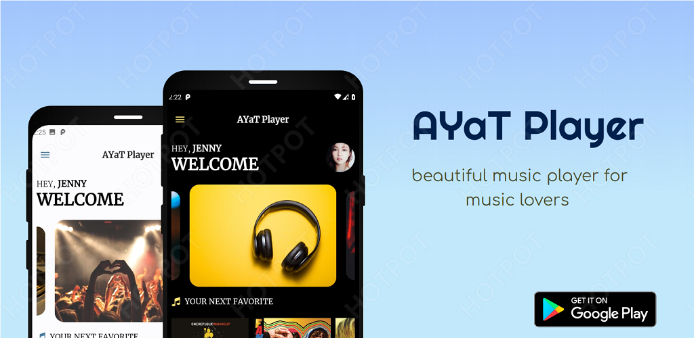
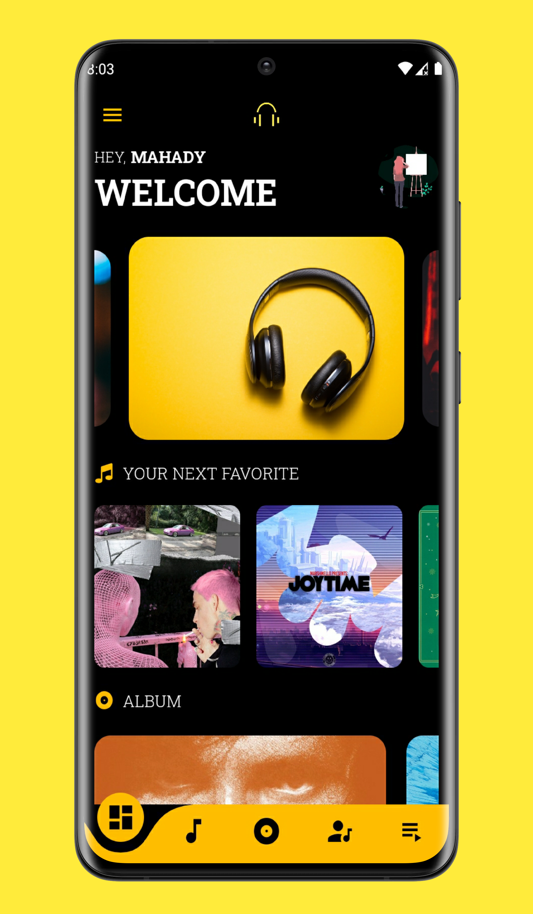
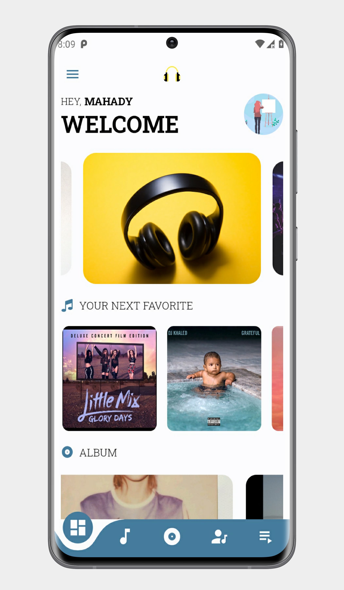
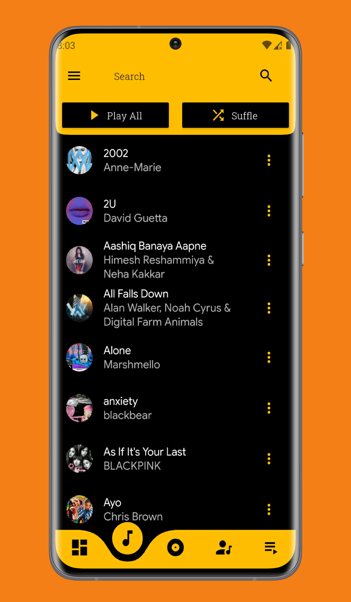
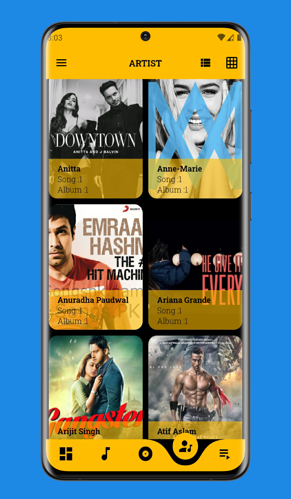
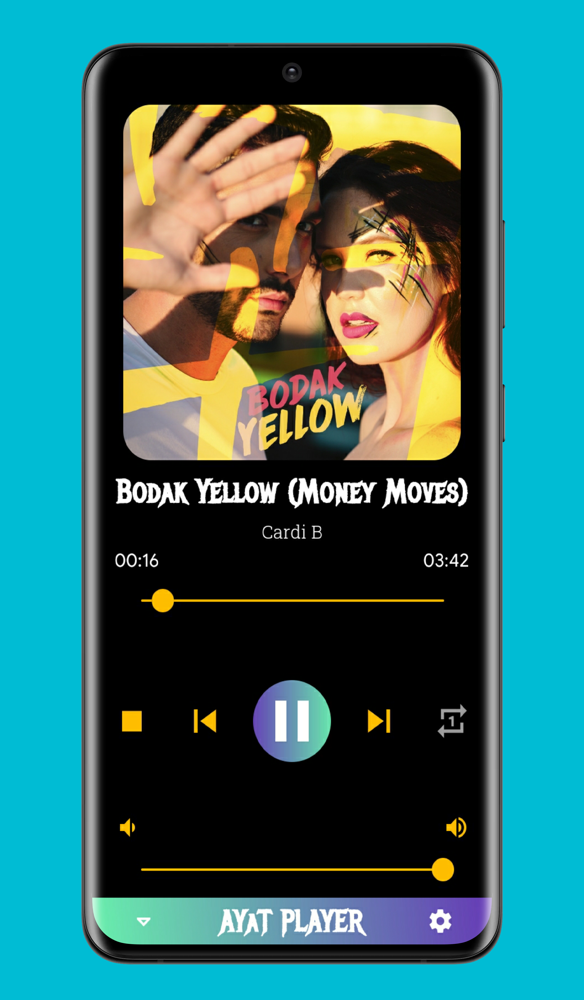
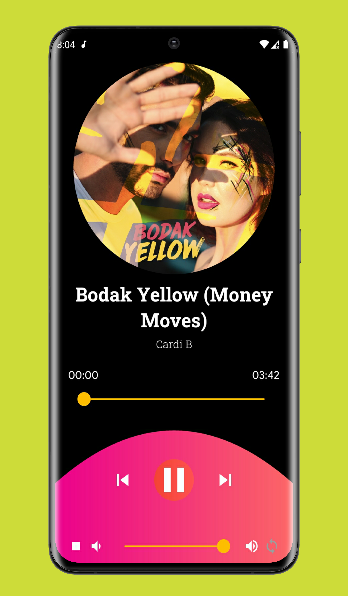

# AYaT Player 

## 🆕 A Beautiful music player for Android music lovers 

## Screenshots
| |
|:---:|
|AYaT Player|
### App Themes
|  |  
|:---:|:---:|
|Dark| Light|

### Player screen
| | | |
|:---:|:---:|:---:|
| Songs | Albums | Artist|

### Now playing themes
 |  |  
|:---:|:---:|
|Classic| Modern|

### 🧭 Easy Navigation 
Self-explanatory interface without overloaded menus

### 🎨 Colorful
You can choose between two different main themes: Light Theme, and Just black for AMOLED displays. Theme comes with default beautiful accent.

### 🏠 Dashboard
Dashboard has beautiful carousel with music related picture from unsplash.Get random songs to start with. Also included Albums , playlist , artist . You will love it.

### 📦 Included Features
-  Base 2 themes (Light and Dark)
-  Choose from 2 now playing themes (more to come)
-  Headset/Bluetooth support
-  Music Duration Filter
-  Volume controls
-  Carousel effect on dashboard
-  Home screen Widgets
-  Lock Screen Playback Controls
-  Playlist add/remove song
-  User profile
-  Browse and play your music by Songs, Albums, Artists, Playlists,

I am trying my best to bring you the best user experience. More features are on the
way.

In any case, you find or notice any Bugs/ Crashes please report them by
sending me an [e-mail](mailto:mahadydev@gmail.com). I will try to respond or fix Bugs/ Crashes as soon as
possible.

### 🗂️ License

AYaT player is released under the GNU General Public License v3.0
(GPLv3), which can be found here: [License](LICENSE.md)

### ☝️ Changelog's

Try the link [here](https://mahadydev.github.io/changelog/ayat-player-changelog.html)

### ☝️ FAQ's
Try the link [here](https://mahadydev.github.io/faq/ayat-player-faq.html)

>Please note: AYaT player is offline local mp3 player app. It
>doesn't support online music download or music streaming.
